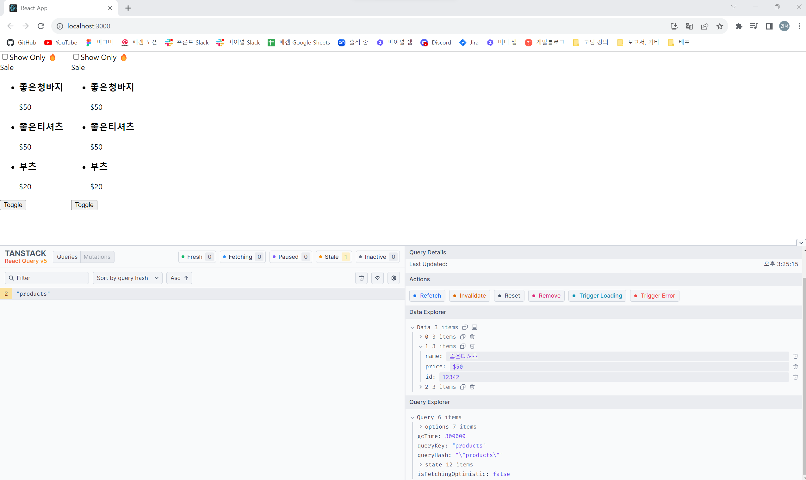

Hooks(함수들)은 값의 재사용이 아니라, 로직의 재사용을 위해 만들어짐

- 리액트 쿼리
  https://tanstack.com/query/latest

1. 설치
   npm i @tanstack/react-query

2. https://tanstack.com/query/latest/docs/react/quick-start
   //app.js에서
   import {
   QueryClient,
   QueryClientProvider,
   } from '@tanstack/react-query'

const queryClient = new QueryClient()
...
return (
<QueryClientProvider client={queryClient}>
<MainProducts />
</QueryClientProvider>
);

3. https://tanstack.com/query/latest/docs/react/reference/useQuery 참고하여 사용
   //products.jsx에서
   const {
   isLoading,
   error,
   data: test,
   } = useQuery({
   queryKey: "test",
   queryFn: async () => {
   return fetch(`-.json`).then((res) => res.json());
   },
   });

4. dev tools 설치
   https://tanstack.com/query/latest/docs/react/devtools

npm i @tanstack/react-query-devtools

5. dev tools 사용
   //app.js에서
   import { ReactQueryDevtools } from '@tanstack/react-query-devtools'
   ...
   return (
   <QueryClientProvider client={queryClient}>
   {/_ The rest of your application _/}
   <ReactQueryDevtools initialIsOpen={true} /> //추가
   </QueryClientProvider>
   )...

=> 

6. stale?
   https://tanstack.com/query/latest/docs/react/guides/important-defaults
   (디폴트: stale은 0, cache는 5분)

   1. useQuery or useInfiniteQuery by default consider cached data as stale !
      => To change this behavior, you can configure your queries both "globally" and per-query using the "staleTime option"

   2. Stale queries are refetched automatically in the background !
      => change this functionality, you can use options like refetchOnMount, refetchOnWindowFocus, refetchOnReconnect and refetchInterval

      => "inactive" queries are garbage collected after 5 minutes, silently retried 3 times, with exponential backoff delay ...
